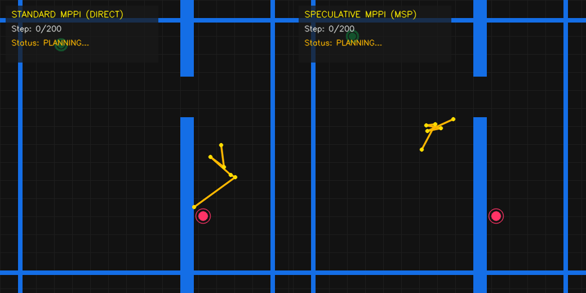

# LeWorldModel reproduction and self-speculative rollout

This folder contains the LeWorldModel (LeWM) reproduction used on the
`lewm-reproduction` branch. It trains an action-conditioned JEPA world model
end-to-end from pixels, evaluates whether the latent contains the agent state,
visualizes rollouts, and benchmarks self-speculative multi-token latent rollout.

## What is implemented

- `eb_jepa/lewm.py`: ViT-Tiny encoder, action-conditioned causal predictor,
  SIGReg loss, MTP loss, autoregressive rollout, and self-speculative latent
  rollout.
- `examples/lewm/main_lewm.py`: training entrypoint.
- `examples/lewm/val_lewm.py`: frozen-checkpoint validation: XY probe quality
  and latent rollout MSE.
- `examples/lewm/viz_lewm.py`: rollout GIF generation with optional
  self-speculative inference.
- `examples/lewm/bench_speculative.py`: timing benchmark comparing vanilla
  autoregressive rollout and self-speculative rollout.
- `examples/lewm/accel_gif.py`: side-by-side animation showing how many
  predictor forwards each method needs.
- `examples/lewm/log_gifs_wandb.py`: upload rollout GIFs and validation metrics
  to W&B.

## Model

Encoder:

- Input: `[B, C, T, H, W]`.
- Each frame is encoded independently.
- ViT-Tiny style backbone: patch embedding, CLS token, transformer blocks.
- Output latent: `[B, T, D]`.
- `use_head=true` uses a learned linear projection before BatchNorm.
- `use_head=false` predicts directly in CLS space, which was added because the
  projection head can collapse the tiny TwoRoom agent signal.

Predictor:

- Input states: `[B, L, D]`.
- Input actions: `[B, >=L, A]`.
- Causal transformer with AdaLN-Zero action conditioning.
- `mtp_horizon=1`: standard one-step predictor.
- `mtp_horizon>1`: MTP heads where head `k` predicts `z_{t+1+k}`.
- MTP heads are conditioned on the future action window `[a_t, ..., a_{t+k}]`.

Loss:

```text
L = prediction_mse + sigreg_lambda * SIGReg(z)
```

For MTP, the prediction loss averages valid `(time, horizon)` pairs.

## Self-speculative rollout

Self-speculative rollout is implemented in `LeWMPredictor.self_speculative_rollout`.

### Approach overview

The GIF below compares the autoregressive baseline with our self-speculative
multi-token rollout. The autoregressive baseline advances one latent step per
predictor call. Our method drafts several future latents with the MTP heads,
verifies them with the horizon-1 head in latent space, keeps the accepted prefix,
and regenerates only after the first mismatch.

<p align="center">
  
</p>

At each chunk:

1. The MTP heads draft up to `mtp_horizon` future latent tokens.
2. The same predictor verifies the draft with the horizon-1 head on the drafted
   prefix.
3. Latent distance is computed between draft and verifier.
4. The accepted prefix is kept.
5. At the first mismatch, the verifier token is kept and the remaining future is
   regenerated from that corrected prefix.

The default comparison is latent `normalized_mse`; no decoded-space threshold is
used.

Useful stats are stored in `pred.last_speculative_stats`:

- `chunks`
- `draft_window`
- `mean_accepted_prefix`
- `mean_verify_distance`
- `accepted_token_rate`
- `effective_steps_per_chunk`

If `mtp_horizon<=1`, self-speculative rollout falls back to vanilla
autoregressive rollout.

## Configs

- `cfgs/lewm_two_rooms.yaml`: base TwoRoom reproduction with `mtp_horizon: 3`.
- `cfgs/lewm_two_rooms_fix.yaml`: anti-collapse TwoRoom config with larger
  agent dot, smaller image size, deeper predictor, history 1.
- `cfgs/lewm_two_rooms_cls.yaml`: CLS-space variant with `use_head: false`.
- `cfgs/lewm_maze.yaml`: simplified maze experiment.

For speedup experiments, train at least one MTP checkpoint. A useful comparison
is:

- baseline: `mtp_horizon=1`
- speculative: `mtp_horizon=3` or `mtp_horizon=4`

## Train

Local:

```bash
PYTHONPATH=$PWD python -m examples.lewm.main_lewm \
  --fname examples/lewm/cfgs/lewm_two_rooms.yaml \
  --folder /path/to/run
```

Cluster:

```bash
CFG=examples/lewm/cfgs/lewm_two_rooms.yaml \
RUN_DIR=/lustre/work/vivatech-yentlteam/gklajer/lewm_train/run_mtp3 \
sbatch examples/lewm/run_lewm.sbatch
```

The checkpoint files are written as:

```text
<run>/
  config.yaml
  e-0.pth.tar
  ...
  latest.pth.tar
```

## Validate a checkpoint

```bash
PYTHONPATH=$PWD python -m examples.lewm.val_lewm \
  --ckpt /path/to/run/latest.pth.tar \
  --feature cls
```

Main outputs:

- linear probe position MSE and Pearson `r`
- nonlinear probe position MSE and Pearson `r`
- latent rollout MSE
- collapse verdict

Interpretation:

- high probe `r`, low probe MSE: the latent contains agent position.
- low rollout MSE but bad probe: likely collapse or nearly constant latent.
- for TwoRoom, CLS probing is often more informative than the projected latent.

## Visualize rollouts

```bash
PYTHONPATH=$PWD python -m examples.lewm.viz_lewm \
  --ckpt /path/to/run/latest.pth.tar \
  --out_dir /path/to/run/viz \
  --speculative True \
  --speculative_threshold 0.05
```

The GIF compares:

- ground-truth frames
- decoded ground-truth latents
- rollout with true actions
- rollout with random actions

For CLS-decoded ground-truth visualization:

```bash
PYTHONPATH=$PWD python -m examples.lewm.viz_lewm \
  --ckpt /path/to/run/latest.pth.tar \
  --out_dir /path/to/run/viz_cls \
  --gt_decode cls
```

## Benchmark self-speculative speed

```bash
PYTHONPATH=$PWD python -m examples.lewm.bench_speculative \
  --ckpt /path/to/mtp_run/latest.pth.tar \
  --out /path/to/mtp_run/speculative_speedup.pdf \
  --threshold 0.1 \
  --repeats 30
```

This measures vanilla `rollout` vs `self_speculative_rollout` over multiple
horizons. Use a CUDA GPU and warmed-up timings for meaningful numbers.

What to report:

```text
method              horizon  time_ms  speedup  accepted_token_rate  rollout_mse
autoregressive      ...
self-speculative    ...
```

The speedup is meaningful only if rollout quality remains acceptable.

## Acceleration GIF

```bash
PYTHONPATH=$PWD python -m examples.lewm.accel_gif \
  --ckpt1 /path/to/mtp1/latest.pth.tar \
  --ckpt4 /path/to/mtp4/latest.pth.tar \
  --out /path/to/accel.gif
```

The animation advances one frame per predictor forward. The MTP
self-speculative side should reach the same horizon with fewer forwards when
drafts are accepted.

## W&B logging

```bash
PYTHONPATH=$PWD python -m examples.lewm.log_gifs_wandb \
  --root /lustre/work/vivatech-yentlteam/gklajer/lewm_train \
  --project lewm
```

This scans run folders, logs rollout GIFs, and builds a summary table with
validation metrics.

## Recommended experiment flow

1. Train an `mtp_horizon=1` baseline.
2. Train an MTP model (`mtp_horizon=3` or `4`) with the same data setup.
3. Run `val_lewm.py` on both checkpoints.
4. Generate rollout GIFs with `viz_lewm.py`.
5. Run `bench_speculative.py` on the MTP checkpoint.
6. Generate `accel_gif.py` with the baseline and MTP checkpoints.
7. Compare speed only after checking latent quality/probe quality.

## Known caveats

- The current benchmark measures latent rollout speed, not full MPC episode
  solving time.
- Full TwoRoom planning integration would need a LeWM planner loop that calls
  `LeWMPredictor.rollout` or `self_speculative_rollout` inside CEM/MPPI.
- Old checkpoints may miss newer MTP action-window projection weights; the viz
  loader is permissive, but retraining is recommended for fair comparison.
- If `accepted_token_rate` is low, speculative rollout can be slower than vanilla
  because it pays draft plus verify cost without advancing many steps.
- Always compare with the same checkpoint, seed, batch size, horizon, device, and
  action tensors when benchmarking rollout speed.
